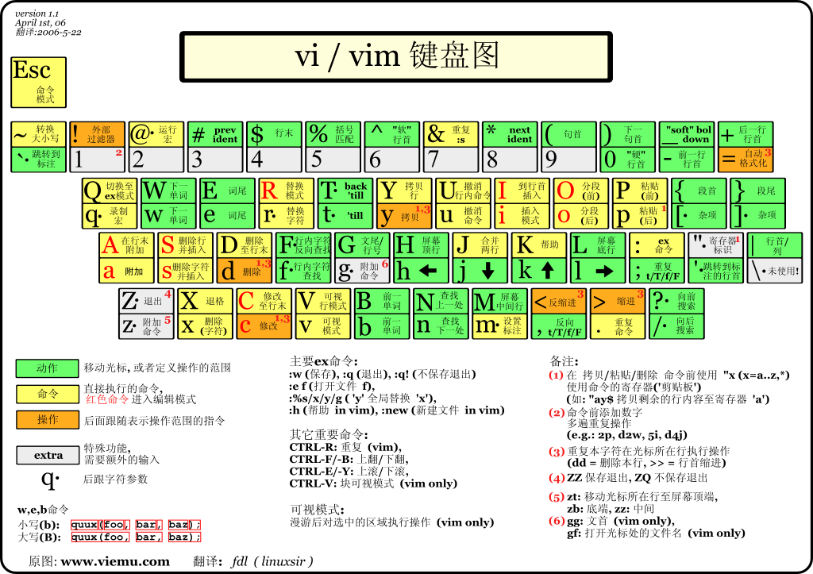

<!-- START doctoc generated TOC please keep comment here to allow auto update -->
<!-- DON'T EDIT THIS SECTION, INSTEAD RE-RUN doctoc TO UPDATE -->
**Table of Contents**  *generated with [DocToc](https://github.com/thlorenz/doctoc)*

- [Vim](#vim)
  - [上下左右：以字符为单位](#%E4%B8%8A%E4%B8%8B%E5%B7%A6%E5%8F%B3%E4%BB%A5%E5%AD%97%E7%AC%A6%E4%B8%BA%E5%8D%95%E4%BD%8D)
  - [以单词为单位移动](#%E4%BB%A5%E5%8D%95%E8%AF%8D%E4%B8%BA%E5%8D%95%E4%BD%8D%E7%A7%BB%E5%8A%A8)
  - [以行为单位移动](#%E4%BB%A5%E8%A1%8C%E4%B8%BA%E5%8D%95%E4%BD%8D%E7%A7%BB%E5%8A%A8)
  - [以屏幕为单位移动](#%E4%BB%A5%E5%B1%8F%E5%B9%95%E4%B8%BA%E5%8D%95%E4%BD%8D%E7%A7%BB%E5%8A%A8)
  - [搜索结果之间跳转](#%E6%90%9C%E7%B4%A2%E7%BB%93%E6%9E%9C%E4%B9%8B%E9%97%B4%E8%B7%B3%E8%BD%AC)
  - [文件之间移动](#%E6%96%87%E4%BB%B6%E4%B9%8B%E9%97%B4%E7%A7%BB%E5%8A%A8)

<!-- END doctoc generated TOC please keep comment here to allow auto update -->

# Vim

Vim 最大的特征与最大的困难就是键盘操作，所以快速移动光标是 Vim 的最基本技能。光标移动可以配合其他快捷键使用，比如 `y`, `x`, `d`, `v`，更好地掌握了光标移动也就更好地掌握了其他编辑技能。

## 上下左右：以字符为单位

1. 进入 Vim 的 normal 模式（如果你在 visual 模式或者 insert 模式，可以按若干次 `Esc` 回到 normal 模式）。
2. `h` 向左移动一个字符。
3. `j` 向下移动一个字符。
4. `k` 向上移动一个字符。
5. `l` 向右移动一个字符。

和其他快捷键一样，可以配合数字来移动多个字符，比如 `5l` 向左移动 5 个字符。

## 以单词为单位移动

多数情况下单词移动比字符移动更加高效，比如要走到当前变量名前加一个 `let`。

- `w` 移动到下一个单词的词首。
- `b` 移动到上一个单词的词首。
- `e` 移动到下一个单词的结尾。

单词移动同样支持数字前缀，比如 `4w` 可以向后移动 4 个单词。此外大写的 `W`, `B`, `E` 具有同样的功能，只不过小写用标点符号来分隔单词，大写用空格来分隔单词，更适合在代码里移动。

## 以行为单位移动

- `^` 移动到行首第一个词的首字母。
- `|` 移动到行首第一个字符。
- `$` 移动到行尾。
- `j` 移动到下一行。
- `k` 移动到上一行。
- `:10` 移动光标到文件第 10 行。可以 `:set number` 来让 vim 显示行号。
- `gg` 移动到文件首行。
- `G` 移动到文件尾行。

上下行移动的命令同样可以加数字，比如 `10j` 向下移动 10 行。

## 以屏幕为单位移动

- `H` 移动到当前屏的首行。
- `L` 移动到当前屏的尾行。
- `M` 移动到当前屏的中间行。
- `zt` 光标所在字符不动，将当前行移动到屏幕顶部，通常用来查看完整的下文，比如函数、类的定义。
- `zz` 光标所在字符不动，将当前行移到屏幕中间。
- `zb` 光标所在字符不动，将当前行移到屏幕底部。
- `ctrl-f` 向下翻页，移动一整个屏幕。
- `ctrl-b` 向上翻页，移动一整个屏幕。
- `ctrl-e` 屏幕向下滚动一行。
- `ctrl-y` 屏幕向上滚动一行。

后面几个 Ctrl 开头的命令是 Unix 命令行的惯例，比如在 `man` 和 `less` 里也适用。

## 搜索结果之间跳转

在 vim 中进行查找时，

- `n` 跳转到下一个匹配。
- `N` 跳转到上一个匹配。
- `ctrl-o` 后退到上一个光标位置。
- `ctrl-i` 前进到下一个光标位置。

## 文件之间移动

- `<backspace>` 跳转到交替文件（上一个文件）。
- `gt` 跳转到下一个标签页。
- `gT` 跳转到上一个标签页。
- `Ctrl+w h` 切换到左边窗格。
- `Ctrl+w j` 切换到下边窗格。
- `Ctrl+w k` 切换到上边窗格。
- `Ctrl+w l` 切换到右边窗格。
- `Ctrl+w w` 遍历切换窗格。
